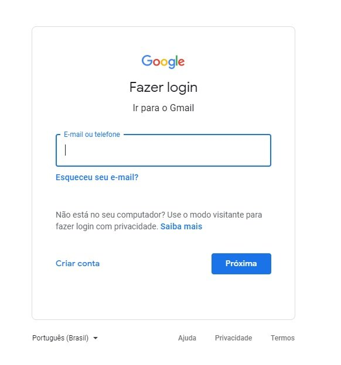
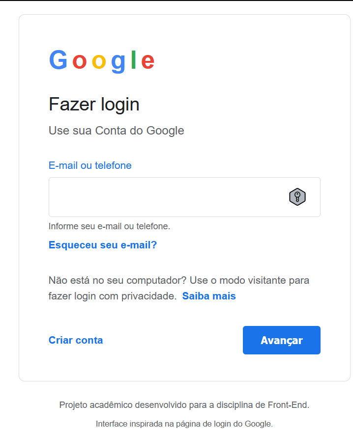

# Trabalho da matéria Front-End
**Nome:** Otavio Biazus de Mello  
**RA:** 1139244

## Referência utilizada

A página escolhida como referência foi a tela de login do Google.

**Link da referência:**  
https://accounts.google.com/

## Descrição do projeto

Este projeto consiste na criação de um clone acadêmico da página de login do Google, desenvolvido com HTML e CSS.

A página foi construída observando a organização visual da referência, utilizando HTML semântico, formulário acessível, variáveis CSS, Box Model, Flexbox e responsividade mobile-first.

## Checklist da Parte 1

### 1.1 – Estrutura HTML semântica e acessível

- Uso de elementos semânticos
- Formulário com campos associados a labels
- Estrutura acessível

Foi utilizado o elemento `<main>` para representar o conteúdo principal da página, `<section>` para organizar o cartão de login e `<footer>` para o rodapé personalizado.

Eu botei no formulário um `<label>` associado ao campo de e-mail por meio dos atributos `for` e `id`.

Não utilizei no projeto imagens externas, portanto não há imagens que necessitem do atributo `alt`.

### 1.2 – Fidelidade visual à referência

- Organização geral semelhante
- Proporções e espaçamentos semelhantes
- Cores semelhantes
- Tipografia semelhante

A página foi desenvolvida observando a estrutura visual da tela de login do Google, buscando manter a organização do conteúdo, espaçamentos, cores, formulário e disposição dos elementos.

### 1.3 – CSS: seletores, Box Model e variáveis

- Variáveis CSS
- Box Model
- Diferentes tipos de seletores
- Pseudo-classes

Utilizei também variáveis CSS no elemento `:root`, como as cores principais da página.

O Box Model foi utilizado em elementos como o cartão de login, campos do formulário e botão, utilizando propriedades como `width`, `padding`, `border`, `margin` e `box-sizing`.

Também utilizei diferentes tipos de seletores, incluindo seletores de classe, seletores descendentes e pseudo-classes como `:hover`, `:focus` e `:focus-visible`.

### 1.4 – Responsividade: Flexbox, Grid e mobile first

- Desenvolvimento mobile-first
- Flexbox
- Media query com `min-width`
- Adaptação para telas maiores

O CSS foi desenvolvido inicialmente pensando em telas menores.

Foi utilizado Flexbox para organizar elementos como as ações do formulário e os links do rodapé.

Também foi criada uma media query utilizando `min-width` para realizar ajustes no layout em telas maiores.

## Comparação com a referência

Página original

Projeto desenvolvido

